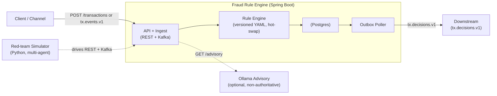

# Fraud Rule Engine

[](https://github.com/maseko-lucky-9/fraud-rule-engine/actions/workflows/ci.yml)
[](https://openjdk.org/projects/jdk/21/)
[](https://spring.io/projects/spring-boot)

A fraud rule engine in **Java 21 / Spring Boot 4**. It receives
transaction events (REST **and** Kafka), evaluates them against versioned
YAML-defined rules, persists explainable decisions to PostgreSQL, and republishes
results to a downstream Kafka topic via a transactional outbox. An optional,
non-authoritative **Ollama AI advisory** assists human reviewers.

It ships with a second deliverable: a **Python red-team simulator** that drives
the live engine with honest, scripted-adversary, and LLM-driven adversary agents,
then writes an audit naming detection gaps.

> **Decision boundary:** the deterministic rule engine is the *only* source of
> truth. AI commentary is opt-in, non-blocking, and never authoritative.
> See [ADR-0010](docs/adr/0010-advisory-ollama.md).

---

## What an inspector can run

This README is organised around the **three things you will most likely want to
run**, in order. Each is self-contained.

| # | Flow | Command (TL;DR) | Needs |
|---|------|-----------------|-------|
| **A** | [Run the application](#a--run-the-application) | `docker compose up -d --build` | Docker |
| **B** | [Run the unit + integration tests](#b--run-the-tests) | `./mvnw verify` | Docker (Testcontainers) |
| **C** | [Run the full simulation](#c--run-the-full-simulation) | `uv run sim run …` | Docker · `uv` · Ollama |

> **Two languages, one repo.** The engine is Java/Maven at the repo root. The
> simulator is Python/`uv` under [`simulator/`](simulator/). They are independent —
> you can do **A** and **B** without ever touching the simulator.

---

## Prerequisites

| Tool | Version | Used by | Notes |
|------|---------|---------|-------|
| Docker + Compose | 24+ | A, B, C | The only hard requirement for **A** and **B**. |
| JDK | **21** | A (local run), B | `.mvnw` wrapper pins Maven; just need a JDK 21 on `PATH`. **JDK 21 specifically** — newer JDKs break the JaCoCo coverage agent. |
| `uv` | 0.5+ | C | Python runner — [install](https://docs.astral.sh/uv/). |
| `jq`, `curl` | any | curl walkthrough | For the examples below. |

> You do **not** need a local Maven, Python, or Postgres install — the `./mvnw`
> wrapper and Docker handle them.

---

## A — Run the application

### 1. Configure secrets (required — the engine fails fast without them)

```bash
cp .env.example .env

# Generate cryptographically-random local-only values and write them into .env:
sed -i.bak "s|^POSTGRES_PASSWORD=.*|POSTGRES_PASSWORD=$(openssl rand -base64 24)|" .env
sed -i.bak "s|^JWT_HS256_SECRET=.*|JWT_HS256_SECRET=$(openssl rand -base64 48)|" .env
sed -i.bak "s|^SERVICE_API_KEY=.*|SERVICE_API_KEY=$(openssl rand -base64 36)|" .env
rm -f .env.bak
```

The three secrets are mandatory: `JWT_HS256_SECRET` (≥ 32 bytes), `SERVICE_API_KEY`
(≥ 32 chars), `POSTGRES_PASSWORD`. The app refuses to boot if any is missing or short.

### 2. Bring up the stack

```bash
docker compose up -d --build      # builds the image; starts api + postgres + redis + redpanda
```

This starts four services: **api** (Spring Boot), **postgres**, **redis**
(idempotency + rate-limit), **redpanda** (Kafka-compatible broker).

### 3. Wait for readiness, then verify

```bash
until curl -s http://localhost:8081/actuator/health/readiness | grep -q UP; do sleep 2; done
curl -s http://localhost:8081/actuator/health       # {"status":"UP",...}
```

- **API:** <http://localhost:8090>  ·  Swagger UI: <http://localhost:8090/swagger-ui.html>
- **Management/actuator:** <http://localhost:8081> (health, info, Prometheus)

### 4. Curl walkthrough

```bash
# (a) Issue a demo JWT (always ROLE_USER):
TOKEN=$(curl -s -X POST http://localhost:8090/auth/token \
  -H 'Content-Type: application/json' -d '{"subject":"alice"}' | jq -r .accessToken)

# (b) Submit a transaction — triggers HIGH_AMOUNT_NEW_ACCOUNT -> REVIEW:
curl -s -X POST http://localhost:8090/api/v1/transactions \
  -H "Authorization: Bearer $TOKEN" \
  -H "Idempotency-Key: demo-$(date +%s)" \
  -H "Content-Type: application/json" \
  -d '{"txId":"d6000001-0000-0000-0000-000000000001","accountId":"ACC-NEW-12",
       "amount":12500,"currency":"ZAR","mcc":"5411","channel":"WEB","country":"ZA",
       "ipCountry":"ZA","deviceId":"d1","accountAgeDays":12,
       "timestamp":"2026-05-19T12:00:00Z"}' | jq .

# (c) List decisions:
curl -s -H "Authorization: Bearer $TOKEN" \
  'http://localhost:8090/api/v1/decisions?size=5' | jq '.items[] | {decisionId,status,score}'

# (d) Admin paths use the service key, not the JWT (hot-reload rules, audit, metrics):
API_KEY=$(grep -E '^SERVICE_API_KEY=' .env | cut -d= -f2-)
curl -s -X POST http://localhost:8090/admin/rules/reload -H "X-Service-Api-Key: $API_KEY" | jq .
curl -s -H "X-Service-Api-Key: $API_KEY" \
  http://localhost:8081/actuator/prometheus | grep -E '^fraud_decisions_total'
```

Expected decision shape for (b):

```json
{
  "decisionId": "<uuid>", "txId": "d6000001-…", "status": "REVIEW", "score": 0.85,
  "ruleSetVersion": 1,
  "matchedRules": [{"ruleId":"HIGH_AMOUNT_NEW_ACCOUNT","priority":800,
                    "reason":"High amount on a young account."}],
  "evaluatedAt": "<iso8601>"
}
```

### 5. (Optional) Enable the AI advisory

The advisory runs Ollama in a **container overlay** — no host install needed.

```bash
docker compose -f docker-compose.yml -f docker-compose.advisory.yml --profile advisory up -d
docker exec fraud-ollama ollama pull phi3:mini       # ~2.3 GB, one-time

# Fetch advisory commentary for a decision (decisionId from step 4):
curl -s -H "Authorization: Bearer $TOKEN" \
  http://localhost:8090/api/v1/decisions/<decisionId>/advisory | jq .
# {"advisoryStatus":"OK","summary":"…","confidence":0.95,"humanReviewRequired":true}
```

Without the advisory profile this endpoint returns **503 + `Retry-After: 10`** —
the core decisioning path is unchanged.

### 6. Tear down

```bash
docker compose down                                  # add -v to also drop volumes
```

---

## B — Run the tests

The JVM suite is fully self-contained: **Testcontainers** starts throwaway
Postgres, Redis, and Kafka — you only need Docker running.

```bash
./mvnw verify
```

What runs (one command):

| Layer | Examples |
|-------|----------|
| Unit | rule engine, predicates, edge cases, golden cases |
| Integration (Testcontainers) | ingest → persist → outbox, Flyway migrations, Redis state |
| Concurrency | `IngestConcurrencyTest`, `HotReloadRaceTest` |
| Contract | `RateLimitFilterContractTest` (Bucket4j + Redis 429 contract) |
| Architecture | ArchUnit boundary rules |
| Coverage gate | JaCoCo — engine LINE **≥ 90 %** (`jacoco:check`) |

**Last verified run:** `BUILD SUCCESS` — **128 tests, 0 failures**, engine LINE
coverage **94.9 %**. The JaCoCo gate enforces **LINE ≥ 90 %** on
`com.capitec.fraud.engine` + `…engine.predicates`, plus a 50 % floor on the
fault-tolerance packages (`publish`, `audit`, `observability`, `config`);
`./mvnw verify` fails if either is missed.

> **JDK note:** use JDK 21. The JaCoCo agent fails to instrument under newer JDKs.
> If `java -version` shows 22+, point Maven at a 21 JDK, e.g.
> `JAVA_HOME=$(/usr/libexec/java_home -v 21) ./mvnw verify` (macOS).

Run a single test class:

```bash
./mvnw -Dtest=RuleEngineTest test
```

---

## C — Run the full simulation

The simulator ([`simulator/`](simulator/)) is a distributed, multi-agent
red-team harness. It spawns parallel persona agents — honest, scripted-adversary,
and **LLM-driven adversary** — that hit the **live engine** over its real REST +
Kafka surface, persist every decision to a SQLite sink, then emit an audit report
naming detection gaps with draft YAML rule stubs.

### Prerequisites for the simulation

- The **engine stack from flow A must be running** (`docker compose up -d`).
- The **Ollama advisory overlay** (flow A, step 5) — the simulator's LLM agents
  and scenario seeding use Ollama on `localhost:11434`.
- `uv` installed.

> **Model:** the simulator's LLM agents use `llama3.1:8b`. Pull it once into the
> same Ollama container the advisory overlay started:
> `docker exec fraud-ollama ollama pull llama3.1:8b` (~4.9 GB). (That container
> can hold both models — `phi3:mini` for the engine advisory and `llama3.1:8b`
> for the simulator.) A CI-safe `--no-llm` mode (below) skips every Ollama call.

> **Kafka port (only matters for the 20 % Kafka transport):** the default
> `.env` ships `REDPANDA_PORT=9092`, but the broker advertises its external
> listener on **19092**, so a host Kafka client must use `localhost:19092`.
> Before flow A, set `REDPANDA_PORT=19092` in `.env`, then point the simulator
> at it with a one-line profile override:
> ```bash
> sed 's/localhost:9092/localhost:19092/' \
>   simulator/simulator/config/profile.default.yaml \
>   > simulator/simulator/config/profile.local.yaml
> # then use:  --profile simulator/config/profile.local.yaml
> ```
> The 80 % REST path works on defaults with no changes; `--no-llm` plus the
> REST-only path needs none of this.

### Run it

```bash
cd simulator
uv sync                                                   # install deps into .venv

# Clean the engine's decision tables so percentiles aren't skewed by prior runs:
uv run sim reset --truncate --env-file ../.env

# Expand the seed archetypes into concrete scenarios (uses Ollama):
uv run sim seed

# Full default profile: ~10 000 transactions / ~100 accounts / ~10 min wall-clock,
# 80% REST + 20% Kafka, plus an internal k6 load sub-phase.
# (Use profile.local.yaml from the Kafka-port note above if you want the 20% Kafka
#  transport; profile.default.yaml is fine for a REST-only / --no-llm run.)
uv run sim run --profile simulator/config/profile.local.yaml

# Render the audit report for the latest run:
uv run sim audit reports/run-latest/
```

**Outputs** land in `simulator/simulator/reports/run-<timestamp>/`:

| File | Contents |
|------|----------|
| `sink.db` | SQLite — one row per submission (status, score, matched rules, latency) |
| `raw_decisions.parquet` | the same rows, columnar, for analysis |
| `audit_report.md` | exec summary · per-rule precision/recall · ranked P0–P2 gaps with draft YAML · load + security sections |

**Last verified run:** 10 585 submissions, **10 585 persisted, 0 dropped**,
decisions spanning APPROVE / REVIEW / BLOCK; audit report generated.

### CI-safe / no-Ollama mode

```bash
uv run sim run --no-llm --profile simulator/config/profile.default.yaml
```

### Simulator unit tests

```bash
cd simulator
uv run pytest -q          # fast unit suite — no Docker/Ollama required
```

More detail (scenario taxonomy, determinism guarantees, layout) is in
[`simulator/README.md`](simulator/README.md).

---

## Architecture (one screen)



Full deep-dive (C4 context/container, sequence diagrams, SLOs): [ARCHITECTURE.md](ARCHITECTURE.md).

### Repository layout

```
.
├── src/main/java/com/capitec/fraud/   # the engine
│   ├── domain/         pure POJOs (Transaction, Decision, Rule, RuleSet)
│   ├── engine/         RuleEngine + RuleLoader + predicates + AtomicReference swap
│   ├── ingest/         REST + Kafka entry, transactional IngestService
│   ├── persistence/    JPA entities + repositories
│   ├── publish/        OutboxPoller (SKIP LOCKED)
│   ├── advisory/       Ollama adapter (Profile=advisory) + noop default
│   ├── api/            REST controllers + RFC 7807 errors
│   ├── audit/ idempotency/ ratelimit/ security/ observability/ config/
├── simulator/                         # the Python red-team harness (uv)
├── docs/adr/                          # architecture decision records
├── docs/runbooks/                     # ops runbooks
├── k6/                                # load script (reused by the simulator)
├── docker-compose.yml                 # core stack (api + postgres + redis + redpanda)
└── docker-compose.advisory.yml        # optional Ollama overlay
```

---

## Troubleshooting

| Symptom | Cause | Fix |
|---------|-------|-----|
| `Bind for 127.0.0.1:8090 failed` | port in use | set `API_PORT=8091` in `.env`, re-up |
| `Bind for 127.0.0.1:5432 failed` | host Postgres running | set `POSTGRES_PORT=5433` in `.env` |
| `JWT secret must be ≥ 32 bytes` at startup | `.env` missing/short secret | re-run the secret-generation step in A.1 |
| `HTTP 401` on `/api/v1/**` | token expired (3600 s TTL) | re-issue via `/auth/token` |
| advisory returns `503 Retry-After` | advisory profile not enabled | run A.5 (advisory overlay + pull model) |
| JaCoCo `IllegalClassFormatException` in `mvnw verify` | JDK 22+ | use JDK 21 (see B) |
| `sim reset` → `UndefinedTable` | wrong `--env-file` / DB not up | ensure flow A is running; pass `--env-file ../.env` |

---

## CI & supply-chain

GitHub Actions runs on every push / PR to `main`
([`.github/workflows/ci.yml`](.github/workflows/ci.yml)):

1. **`./mvnw verify`** — unit + integration (Testcontainers) + ArchUnit + JaCoCo gate.
2. **Secret + static scan**.

Both gates are green on `main`.

---
